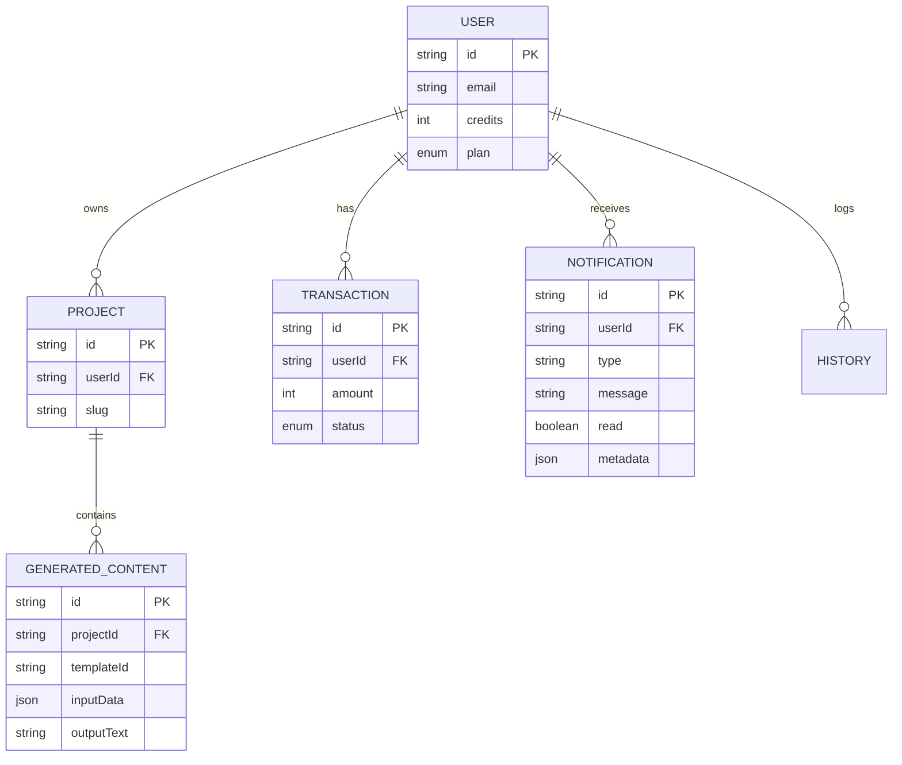

# Database Schema Relationships

This document explains how the data models in `prisma/schema.prisma` relate to each other to support the application features, including the new Notification and History systems.

## Entity Relationship Implementation

### 1. User & Identity
**`User`** is the central entity.
*   **Ownership**: A User *owns* multiple **Projects**. (`User 1 -- * Projects`)
*   **Balance**: A User holds a `credits` balance (Integer).
*   **Financials**: A User has a list of **Transactions** (for auditing credit usage and purchases).
*   **Engagement**: A User has many **Notifications** and **History** entries.

### 2. Projects (The Organizational Unit)
**`Project`** is the container for content.
*   **Relation to User**: 
    *   `userId`: References the User who owns it.
    *   `@@unique([userId, slug])`: Ensures that a user cannot have two projects with the same URL slug (e.g., two projects named "Marketing" -> `/project/marketing`).
*   **Relation to Content**: A Project contains many **GeneratedContent** items. (`Project 1 -- * GeneratedContent`)
*   **Cascade Delete**: If a User deletes a Project, all *Content* inside it is automatically deleted (Self-cleaning).

### 3. Generated Content (The Core Asset)
**`GeneratedContent`** represents a single successful AI generation.
*   **Relation to Project**: 
    *   `projectId`: It MUST belong to a project. It cannot exist as an "orphan". This enforces the "Select Project" rule in the UI.
*   **Template Metadata**:
    *   `templateId`: A string identifier (e.g., "twitter-thread"). We don't need a separate "Template" table because templates are code-defined configurations (Project files), while the *usage* of them is data.
*   **Data Flexibility**:
    *   `inputData` (JSON): Stores the form inputs (Topic, Tone, etc.). Using `JSON` is powerful here because different templates have completely different input fields. We don't need 50 different columns for every possible valid input.

### 4. Transactions (The Ledger)
**`Transaction`** acts as an immutable log.
*   **Audit Trail**: Instead of just changing `User.credits` directly and losing the history, we record every change here.
*   **Types**: 
    *   `USAGE`: Negative value (User generated content).
    *   `CREDIT_PURCHASE`: Positive value (User paid for credits).

### 5. Notifications (Real-Time Feedback)
**`Notification`** stores alerts for the user.
*   **Relation to User**: 
    *   `userId`: Who behaves the notification belong to. (`User 1 -- * Notifications`).
*   **Metadata**: 
    *   `actor/actorId`: Optional fields to link the notification to the source (e.g., "System" or an specific Project ID).
    *   `read`: Boolean flag to track unread status.
*   **Persistence**: Notifications are stored in Postgres to allow fetching "past alerts" even if the user was offline when they happened.

### 6. History (Global Timeline)
**`History`** provides a chronological view of all activities.
*   **Relation to User**: Directly linked to `User` for fast global querying (`/history` page).
*   **Redundancy**: While similar to `GeneratedContent`, this table is optimized for *display* and *reading* across the entire account, whereas `GeneratedContent` is optimized for *project-specific* organization.

## Visual Representation

